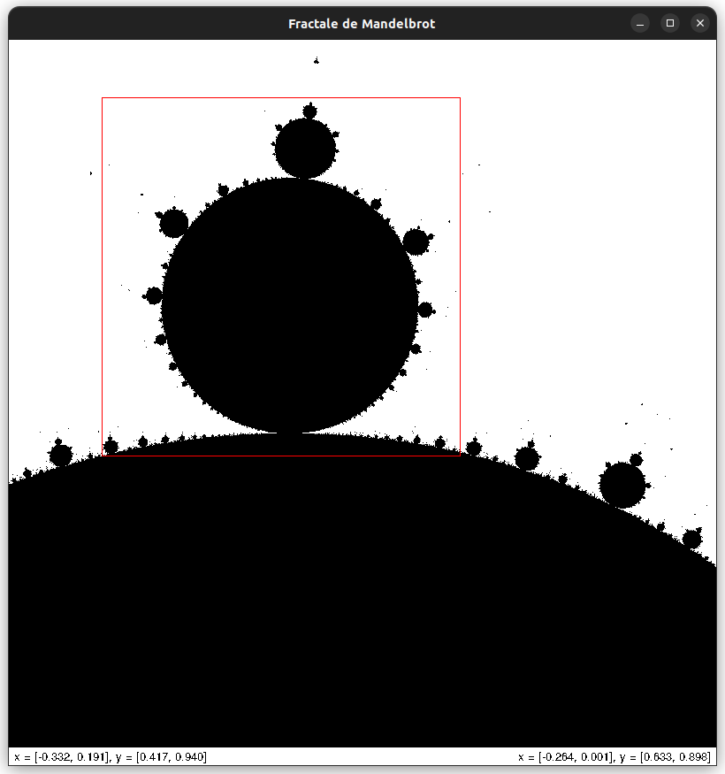

## Application d'affichage de la fractale de Mandelbrot

Cette application graphique, écrite en Python et utilisant le paquet Tkinter, réalise l'affichage de l'[ensemble de Mandelbrot](https://fr.wikipedia.org/wiki/Ensemble_de_Mandelbrot) et permet son exploration grâce à une fonctionnalité de zoom.

### Lancement de l'application

Il convient d'installer la bibliothèque Numpy (`apt install ^python3-numpy.*`, sous Ubuntu), puis taper `python ensemble_mandelbrot.py` en ligne de commande (voir plus bas pour des options).

### Historique

J'ai écrit la première version de ce programme en 2020 suite à mon apprentissage du langage Python et à ma découverte du paquet Tkinter, et en raison de mon intérêt pour les fractales (le tracé de l'ensemble de Mandelbrot est un peu mon _hello-world_ de l'apprentissage de toute bibliothèque graphique). Le but était non seulement l'affichage de l'ensemble mais aussi et surtout de permettre d'explorer cette fractale grâce à une fonctionnalité de zoom. Cela a nécessité la gestion de plusieurs événements (clic initial, déplacement de la souris bouton appuyé, relâchement du bouton) et le calcul de nouvelles coordonnées de représentation à partir du cadre de zoom dessiné.
La version initiale du programme est disponible dans le premier commit de ce dépôt.

Je me suis replongé dans ce code pour revoir Tkinter après avoir postulé à une offre de développeur Python proposant de reprendre une application graphique d'analyse d'images (à laquelle bien évidemment je n'ai pas été pris, puisque les débutants sont des gros nazes qui ne savent rien faire et auxquels on ne laisse pas une seule chance de s'exprimer...).  
Mon but était d'améliorer cette application avec les objectifs suivants :
- rendre le code orienté objet
- utiliser le motif de conception MVC 
- corriger des erreurs d'affichage (axe y inversé, figure inversée après un zoom dans certains cas de définition du cadre)
- ajouter des fonctionnalités (affichage de coordonnées, retour en arrière, etc.) 
- ajouter des couleurs dans les zones de divergence de la suite de récurrence définissant l'ensemble

### Fonctionnalités

Les fonctionnalités de l'application sont les suivantes :
- au démarrage, elle affiche l'ensemble sur la zone x = [-2, 1] et y = [-1.5, 1.5]
- il est possible de zoomer sur une partie de la zone de représentation courante en dessinant un cadre de zoom. Cela s'effectue en cliquant sur un point qui définit alors le premier coin du cadre, en déplaçant la souris bouton appuyé vers un point qui définit le coin opposé et en relâchant le bouton. Le calcul de l'ensemble sur la nouvelle zone se fait immédiatement
- par défaut la hauteur et la largeur du canevas de dessin sont identiques mais cela peut-être modifié (voir plus loin). Dans tous les cas, le cadre de zoom est contraint à respecter le ratio entre hauteur et largeur (sinon l'image est déformée après un zoom)
- différentes coordonnées apparaissent dans un cadre situé en-dessous du canevas de dessin : les bornes de la zone de représentation à gauche de celui-ci, les coordonnées du pointeur de la souris ou les bornes du cadre de zoom à droite
- les coordonnées sont affichées avec un nombre de décimales constant pour une zone de représentation donnée et avec un nombre croissant au fur et à mesure que les zones sont plus petites (3 décimales après le nombre de décimales communs entre les bornes x ou y d'une zone)
- il est possible de revenir à la représentation précédente par la combinaison de touches "ctrl-z"
- différentes options en ligne de commande permettent de définir la hauteur (`-h`) et la largeur (`-l`) en pixels du canevas de dessin ainsi que le nombre d'itération maximal (`-n`) dans le calcul de la suite de récurrence définissant l'ensemble

### Caractéristiques

L'application possède les caractéristiques suivantes :
- le motif de conception mis en oeuvre est un motif MVC simplifié (voir le diagramme de classes dans le fichier "diagramme_classes.png") : la classe d'interface définissant la fenêtre principale joue également le rôle de contrôleur. En effet, étant donné la simplicité du modèle et le nombre réduit d'appels à celui-ci, utiliser un contrôleur n'aurait fait qu'ajouter un niveau de classe supplémentaire alourdissant les appels de méthodes
- le modèle consiste en une classe Mandelbrot possédant une sous-classe modélisant la zone de représentation (coordonnées, image en pixels sous-jacente, etc.) et une méthode de calcul de l'ensemble utilisant la bibliothèque Numpy
- les vues sont les suivantes : une classe pour la fenêtre principale, une autre définissant le canevas de dessin étendant les capacités du widget Canvas dont elle dérive pour l'affichage de l'ensemble et le tracé d'un cadre de zoom, un widget pour l'affichage des coordonnées
- le calcul de l'ensemble de Mandelbrot et son affichage ont été optimisés pour donner une application plus réactive. Le calcul n'est plus fait pixel par pixel avec boucle d'itération pour chaque, mais matriciellement, la boucle d'itération calculant à chaque tour un terme de la suite pour l'ensemble des pixels. De même, l'affichage ne se fait plus non plus pixel par pixel mais, pour une ligne donnée, par tracé global des pixels contigus de l'ensemble.

### A venir

D'autres travaux sont à venir :
- affichage de couleurs dans les zones de divergence de la suite de récurrence définissant l'ensemble de Mandelbrot
- poursuite éventuelle du travail d'affichage non-bloquant, malgré l'optimisation, avec notamment l'utilisation de la programmation asynchrone
- ajout éventuel d'un panneau de contrôle (choix de la couleur ou de niveaux de gris pour les zones de divergence, choix des coordonnées, nombre d'itérations, etc.)
